# Power BI Data Modelling Project

## 1. Project Overview

This project focused on transforming a collection of operational business data into a structured dimensional data model built around a core **Star Schema** for analytical reporting using Microsoft Power BI and Power Query.

The source dataset contained multiple tables covering customers, products, orders, sales, campaigns, inventory, geography, shipments, invoices, payments, and other supporting business information.

The modelling process involved data preparation, transformation, dimension and fact table creation, relationship design, analytical measures, validation, and Row-Level Security (RLS).

The final architecture is a **dimensional model built around a core sales star schema, with additional related fact tables and specialised modelling structures.**

### Key Areas

* Power Query transformations
* Dimensional modelling
* Star Schema
* Fact and dimension tables
* Data validation
* DAX measures
* Date modelling
* Campaign modelling
* Accumulating snapshots
* Row-Level Security

---

# 2. Dataset

The initial dataset contained the following source tables:

`address`, `campaign_log`, `user_details`, `subcategories`, `sales_targets`, `regions`, `campaignskus`, `cities`, `cust_master`, `customer_contacts`, `exchange_rates`, `invoice_lines`, `inventory`, `invoices`, `order_line_items`, `orders2025`, `orders2026`, `payments`, `products`, `channels`, `shipments`, and `sheet1`.

These tables represented different areas of the organisation's operational data.

Rather than loading every source table directly into the reporting model, relevant information was transformed and reorganised into purpose-specific fact and dimension tables.

---

# 3. Initial Data Assessment

The project began by loading and examining the available tables in Power BI.

This was my first time using Power BI with an Excel-based source rather than directly connecting to SQL Server. During the initial assessment, several structural and data-quality issues were identified, including:

* Inconsistent table and column naming
* Duplicate or redundant tables
* Unnecessary columns
* Incorrect column headers
* Different names for equivalent fields
* Inconsistent values affecting merges
* Multiple tables containing information that could be consolidated into dimensions

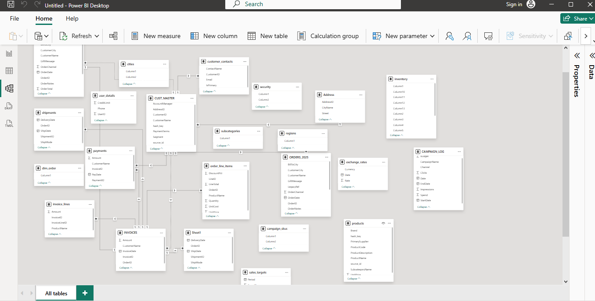

---

# 4. Power Query Organisation

The Power Query environment was organised into logical groups to separate source data from the analytical model.

### Staging

The original source queries were retained as staging data for subsequent transformations.

### Dimensions

Descriptive entities such as customers, products, campaigns, geography, dates, and order flags were organised as dimensions.

### Facts

Business events and measurable processes were organised as facts, including sales, inventory, sales targets, campaign spend, promotion coverage, and order processing.

### Supporting

Supporting structures such as the security and measures tables were maintained separately.

This organisation helped distinguish source data, transformations, and final analytical tables.

---

# 5. Dimensional Modelling — Star Schema

The final analytical model is primarily structured using a **Star Schema**, in which a central fact table is connected to surrounding dimension tables.

The core sales model uses `fact_sales` as the central fact table, with the following dimensions providing descriptive context:

* `dim_customer`
* `dim_product`
* `dim_geo`
* `dim_date`
* `dim_order_flags`

Conceptually:

```text
                    dim_customer
                         |
                         |
dim_product ---- fact_sales ---- dim_geo
                         |
                         |
                      dim_date
```

The dimensions contain descriptive attributes, while the fact table contains transactional data and measurable values.

The model extends beyond this core sales star through additional fact tables representing inventory, sales targets, campaign activity, promotion coverage, and order processing.

Therefore, the overall architecture is a **dimensional model containing multiple related star-schema structures**, rather than one single star schema.

### Why Star Schema?

The structure helps to:

* separate measures from descriptive attributes
* reduce unnecessary duplication
* simplify analytical queries
* provide consistent filtering
* make the model easier to navigate
* support analysis across multiple business dimensions

---

# 6. Customer Dimension

## 6.1 Creating `dim_customer`

`cust_master` was used as the starting point for the customer dimension.

A reference query was created so that the original source query remained available while the analytical version was transformed independently.

Customer-related tables were first arranged together to support the modelling process.

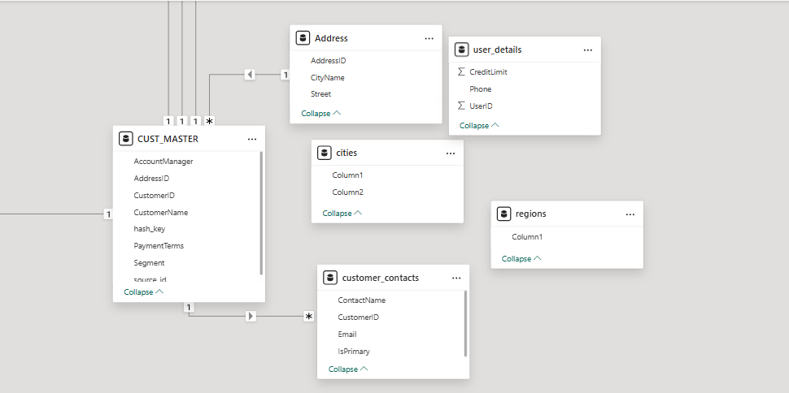

---

## 6.2 Customer Data Merging

`customer_contacts` was merged with the customer data using a Left Outer Join on `customer_id`. Primary contact records were retained to avoid unnecessarily duplicating customers.

Additional information was incorporated through merges with `user_details` and `address`.

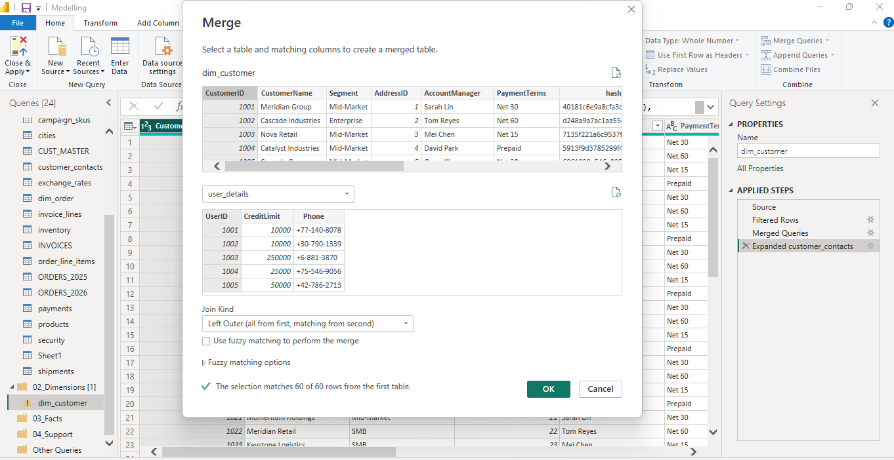

The `cities` table also required its first row to be promoted to headers before it could be used correctly.

The completed customer dimension was cleaned by removing unnecessary fields such as the hash key, source ID, and `is_true`, while remaining fields were standardised using `snake_case`.


The original source relationships were then removed so that the new dimensional structure could be established.

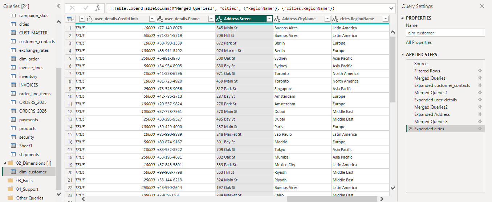

---

# 7. Product Dimension

## 7.1 Creating `dim_product`

A reference of the original `products` table was used to create `dim_product`, preserving the original source query.

The `subcategories` table contained category and subcategory information within a single field separated by a pipe (`|`). The field was split into separate attributes, renamed, and standardised.

A new `product_key` was created to uniquely identify products within the analytical model.

The customer and product dimensions were then positioned together within the developing model.

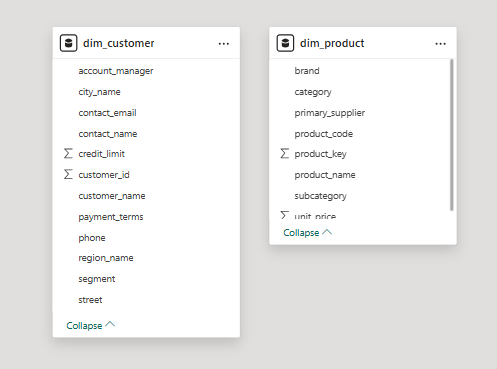

The remaining model structure after creating the two dimensions is shown below.

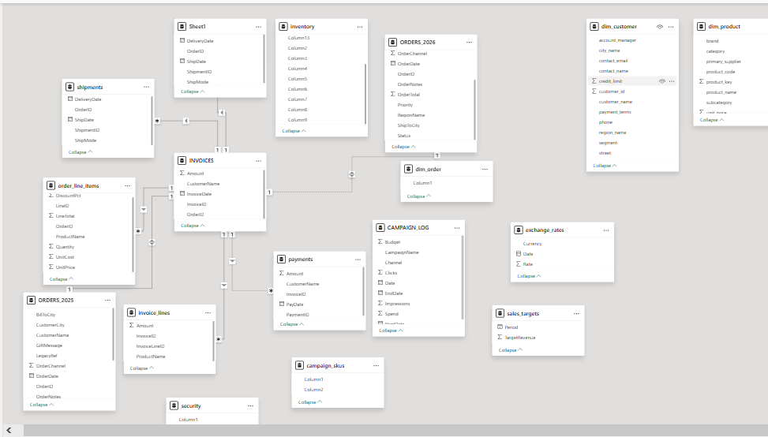

---

# 8. Sales Fact

## 8.1 Preparing the Sales Data

`orders2025` and `orders2026` were appended into a consolidated orders query.

Unnecessary fields such as `legacy_id`, `giftmessage`, and `order_notes` were removed.

A reference of the orders data was used to create `dim_order_flags`, with a `flag_key` providing a unique identifier.

A reference of `order_line_items` was then created and renamed `fact_sales`.

The tables required to construct the sales fact were assembled before relationships were established.

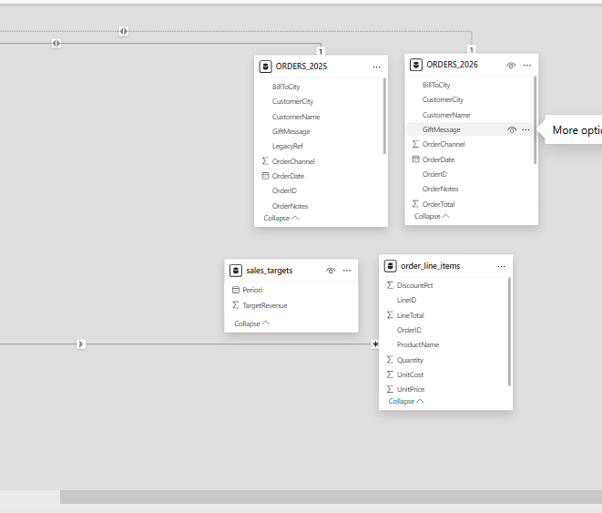

---

# 9. Sales Validation

Before continuing with the model, the sales amount was checked to provide a validation point.

The total line value was:

**526,643.91**

This value was used as a reference point to verify that transformations and merges did not unintentionally alter the underlying transaction values.


---

# 10. Building the Sales Star Schema

The core fact and dimension tables were deliberately arranged into the intended Star Schema before relationships were created.

`fact_sales` was positioned as the central fact table, with `dim_customer`, `dim_product`, `dim_geo`, and `dim_order_flags` surrounding it.

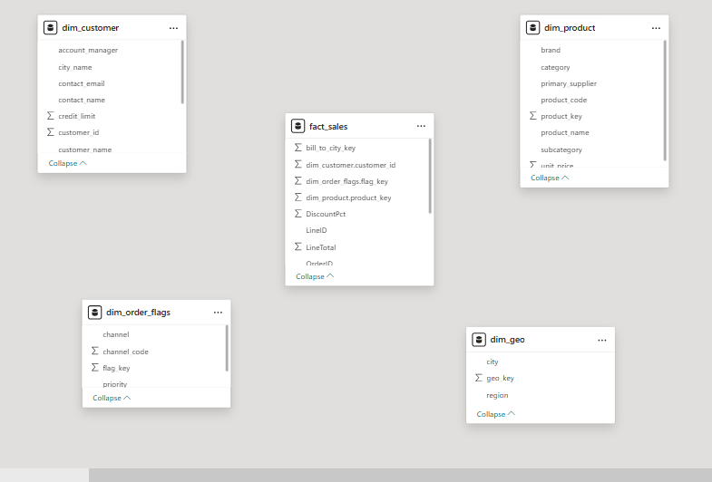

Relationships were then established between the central `fact_sales` table and its surrounding dimensions, primarily using one-to-many relationships from the dimension side to the fact side.

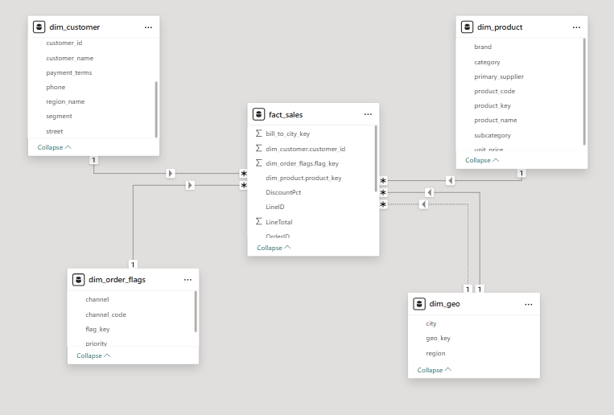

This established the core sales star schema, with dimensions providing descriptive context and `fact_sales` containing the underlying sales transactions and measurable values.

---

# 11. Geographic and Inventory Modelling

A dedicated `dim_geo` table was created to consolidate geographic information.

It contains location attributes such as:

* City
* Region
* `geo_key`

The `geo_key` provides a consistent identifier for associating geographic information with sales.

The model was then extended with `fact_inventory`, which is connected to the product dimension.

This keeps inventory as a separate business process while allowing it to be analysed using shared product information.

---

# 12. Campaign Modelling

Campaign data required additional preparation because the source contained both descriptive campaign information and performance measures.

## 12.1 Campaign Dimension

A reference of `campaign_log` was used to create `dim_campaign`.

Measure-related fields such as date, clicks, spend, and impressions were removed so that descriptive campaign information could be separated from performance data.

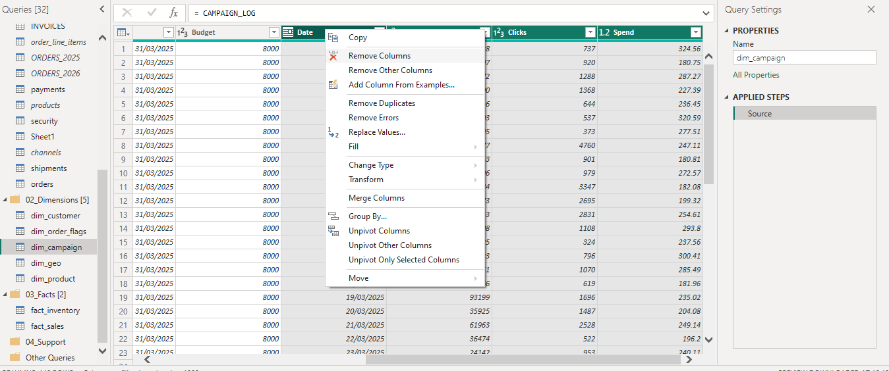


Duplicate campaign records were then identified and removed.

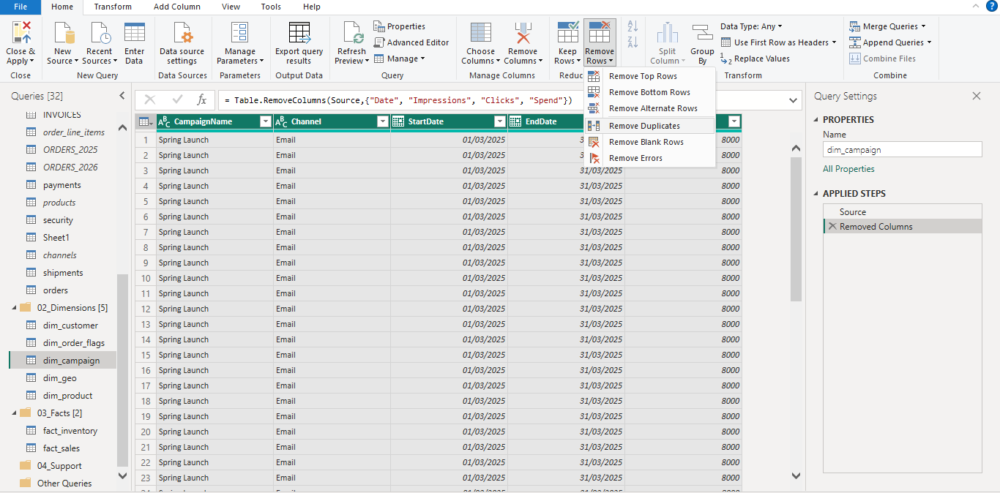

The resulting table was used as the descriptive campaign dimension.

---

## 12.2 Campaign SKU Preparation

The `campaignskus` table required restructuring because of incorrectly labelled headers.

The first row was promoted to headers.

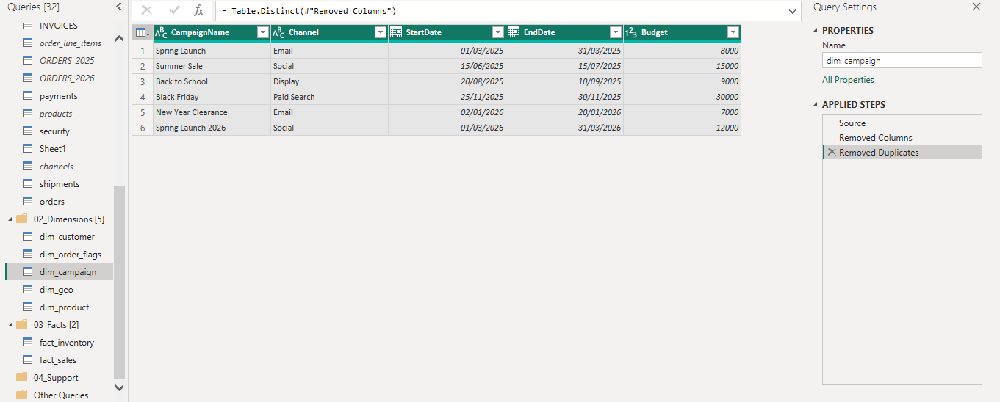

The SKU field contained multiple products within individual rows. The values were split into separate rows and whitespace was trimmed before the resulting campaign-product relationships were incorporated into `fact_promotion_coverage`.

The resulting table contains:

* `campaign_key`
* `product_key`

Because it records campaign-product associations without conventional numeric measures, it functions as a **factless fact/associative table**.

---

# 13. Campaign Promotion and Spend

The campaign-related structures were then integrated into the wider model.

`fact_promotion_coverage` represents campaign-product associations, while `fact_campaign_spend` stores campaign performance measures.

A reference query was created as `fact_campaign_spend`. Campaign data was merged with `dim_campaign` to obtain the appropriate `campaign_key`.

The final campaign spend fact contains:

* `campaign_key`
* `clicks`
* `date`
* `impressions`
* `spend`

It is connected to `dim_campaign` and `dim_date`, allowing campaign performance to be analysed by campaign and time.


---

# 14. Order Process — Accumulating Snapshot

A separate fact table was created to represent the progression of an order through multiple operational stages.

This is an **accumulating snapshot**, which tracks the progress of a business process through multiple milestones rather than recording isolated transactions.

The process can be represented as:

**Order → Shipment → Invoice → Payment**

A reference of the orders table was created as `fact_order_process`.

The table was reduced to the information required for process tracking and merged with `dim_customer` to obtain `customer_id`.

Shipment, invoice, and payment information were then incorporated.

A calculated field was created to measure the number of days between the order date and payment date.

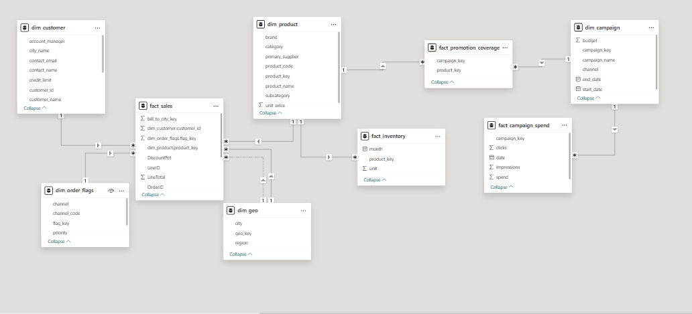

The completed process fact was then integrated into the wider model.

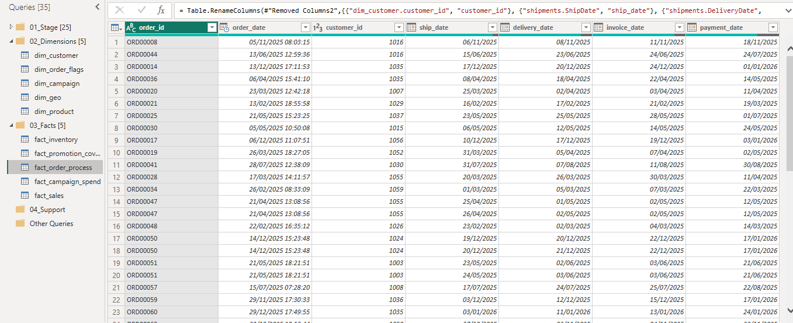


---

# 15. Sales Targets and Date Dimension

The model includes `fact_sales_target` for storing sales target information.

A dedicated `dim_date` table was created using:

`CALENDARAUTO()`

Additional attributes were created for month and year.

The date dimension provides a common time structure that can be shared across fact tables.

It is used with sales targets and campaign spending to support consistent time-based analysis.

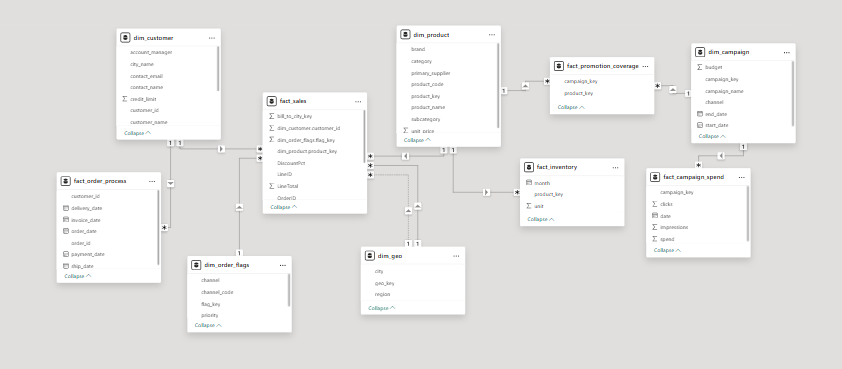

---

# 16. Row-Level Security

Row-Level Security was implemented to restrict users to data associated with their assigned region.

A `security` table was connected to `dim_customer`, and the role:

`regional_access`

was created.

The security configuration used a lookup-based approach to determine the appropriate region for each user.

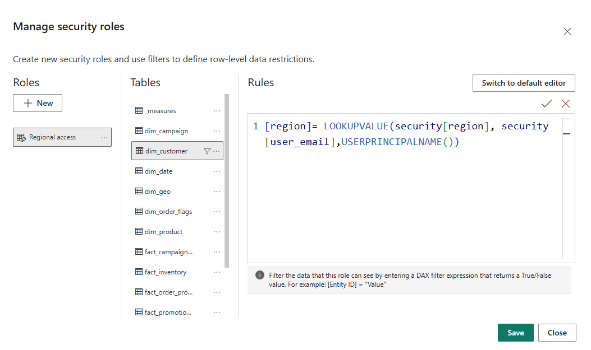

The role was tested using Power BI's **View as Roles** functionality.

The test used:

`Hans.weber@arka.com`

with the user associated with the Europe region.

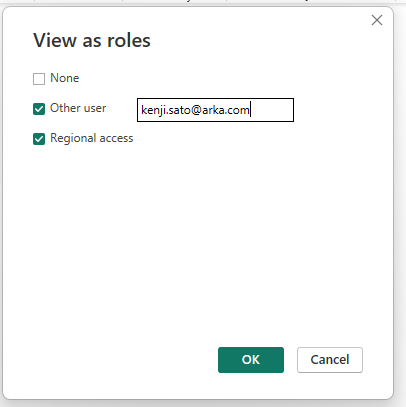

The restricted model was then inspected to verify that the appropriate measures were available to the user.

**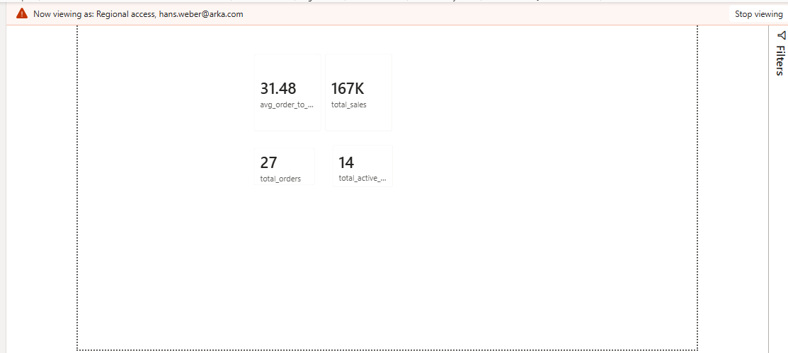

The customer data was also inspected to verify that the regional restriction was being applied.

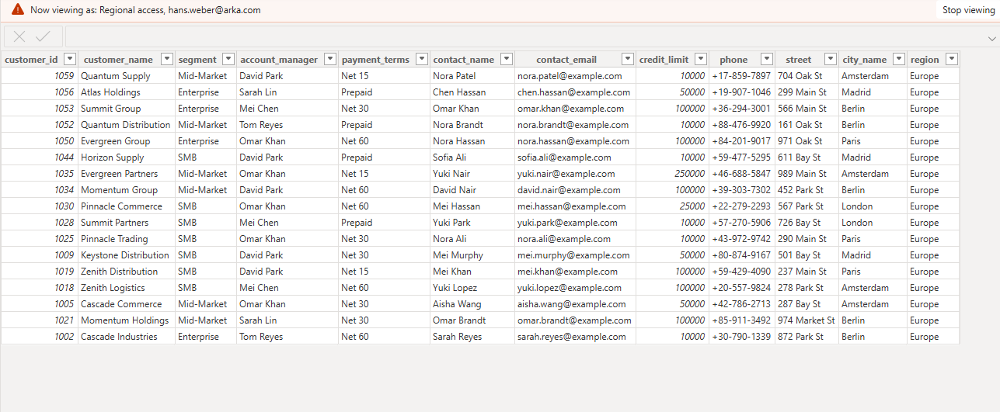

---

# 17. Measures and DAX

A dedicated `_measures` table was created to centralise the model's DAX measures.

Measures created included:

* `total_sales`
* `total_orders`
* `total_active_customers`

Centralising measures keeps analytical calculations organised and separate from the individual fact tables.

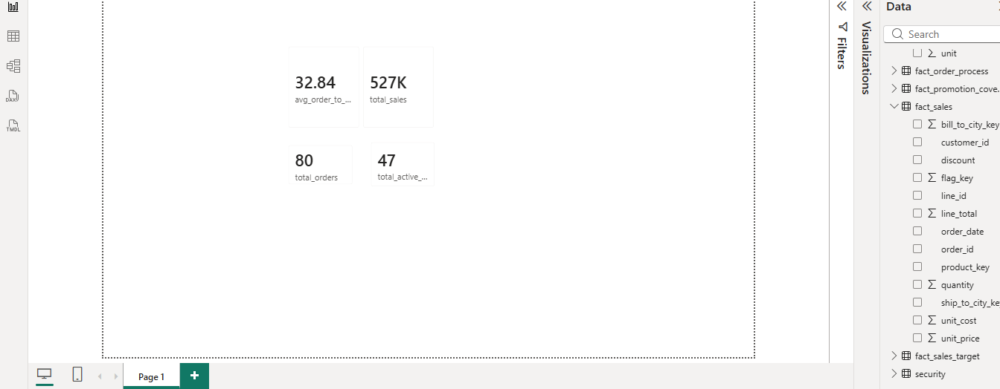

The normal customer dimension view was also retained as a reference when validating the model and comparing the unrestricted and RLS-filtered views.

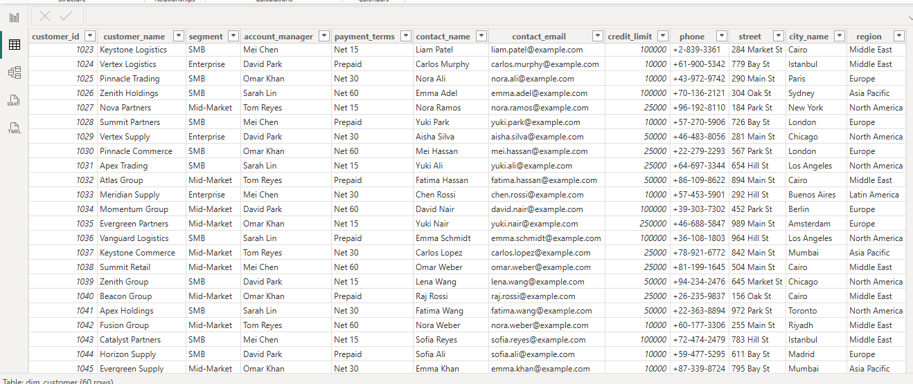

---

# 18. Data Validation and Quality Checks

Validation was performed throughout the modelling process.

### Sales Validation

The sales total of **526,643.91** was used as a reference point when validating the transformed sales fact.

### Structural Validation

The model was reviewed for:

* Duplicate records
* Appropriate keys
* Unnecessary columns
* Correct table structures
* Relationship cardinality
* Fact/dimension separation

### Security Validation

RLS was tested using **View as Roles** to verify that regional restrictions were being applied.

These checks helped reduce the risk of introducing inconsistencies during transformation and modelling.

---

# 19. Query Load Management

Once information from source tables had been incorporated into analytical dimensions or facts, supporting queries that were no longer required independently were disabled from loading into the final model.

This retained the transformation logic without unnecessarily loading duplicate information.

The `sheet1` table was also identified as redundant because of its similarity to existing shipment information and was removed from the model.

---

# 20. Key Modelling Decisions

Several modelling decisions shaped the final architecture.

### Reference Queries

Reference queries were used to create analytical dimensions and facts while preserving the original source queries.

### Analytical Keys

Keys including:

* `product_key`
* `campaign_key`
* `flag_key`
* `geo_key`

were created where required.

### Fact and Dimension Separation

Descriptive attributes were consolidated into dimensions, while measurable events and processes were represented as facts.

### Shared Dimensions

Dimensions such as `dim_date`, `dim_product`, and `dim_campaign` provide common analytical context across related fact tables.

### Core Star Schema

`fact_sales` was positioned as the central fact table with customer, product, geography, date, and order-related dimensions surrounding it.

### Specialised Modelling Structures

Additional fact tables were created for inventory, campaign activity, promotion coverage, sales targets, and order processing rather than forcing unrelated processes into a single fact table.

### Accumulating Snapshot

`fact_order_process` was designed to track the progression of orders through shipment, invoicing, and payment stages.

### Controlled Access

RLS was implemented to restrict regional data access according to user assignments.

---

# 21. Final Data Model Architecture

The final model consists of several interconnected dimensions, facts, and supporting tables.

### Dimensions

| Dimension         | Purpose                                                |
| ----------------- | ------------------------------------------------------ |
| `dim_customer`    | Customer and customer-related descriptive information  |
| `dim_product`     | Product, category, subcategory and supplier attributes |
| `dim_campaign`    | Campaign descriptive information                       |
| `dim_geo`         | Geographic attributes                                  |
| `dim_date`        | Common date, month and year context                    |
| `dim_order_flags` | Order-related categorical information                  |

### Fact Tables

| Fact                      | Purpose                                   |
| ------------------------- | ----------------------------------------- |
| `fact_sales`              | Sales transaction data                    |
| `fact_inventory`          | Product inventory information             |
| `fact_sales_target`       | Sales target information                  |
| `fact_campaign_spend`     | Campaign clicks, impressions and spending |
| `fact_promotion_coverage` | Campaign-product associations             |
| `fact_order_process`      | Order lifecycle/process information       |

### Supporting Tables

| Table       | Purpose                         |
| ----------- | ------------------------------- |
| `_measures` | Centralised DAX measures        |
| `security`  | Regional access control for RLS |

The overall architecture is a **dimensional model built around a core sales star schema, with additional related fact tables and specialised modelling structures.**

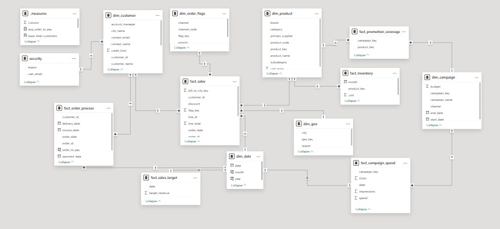

---

# 22. Skills Demonstrated

### Power BI

* Data modelling
* Model view organisation
* Relationships
* DAX measures
* Row-Level Security
* View as Roles testing

### Power Query

* Reference queries
* Merging
* Appending
* Left joins
* Splitting columns
* Splitting values into rows
* Promoting headers
* Text transformation
* Removing duplicates
* Removing unnecessary columns
* Query load management

### Data Modelling

* Dimensional modelling
* Star Schema
* Fact and dimension tables
* One-to-many relationships
* Analytical keys
* Shared/conformed dimensions
* Factless fact/associative modelling
* Accumulating snapshots

### Data Quality

* Data profiling
* Standardisation
* Duplicate handling
* Structural validation
* Measure validation

---

# 23. Project Outcome

The project transformed a collection of operational business tables into a structured analytical model in Power BI.

The final model provides a foundation for analysing:

* Sales
* Customers
* Products
* Inventory
* Sales targets
* Campaign performance
* Promotional coverage
* Order processing
* Geography
* Regional business activity

The project demonstrates the process of taking operational data through preparation, transformation, dimensional modelling, validation, analytical calculations, and controlled access.

The resulting architecture is built around a **core sales star schema**, with additional fact tables and specialised structures supporting other business processes.


